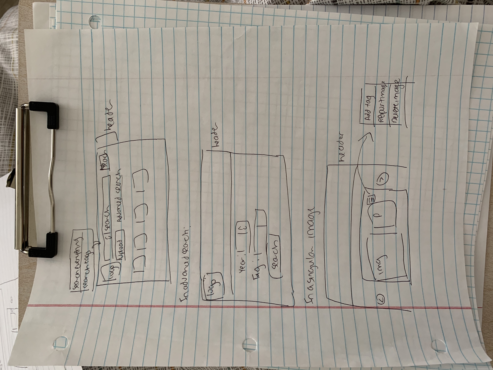
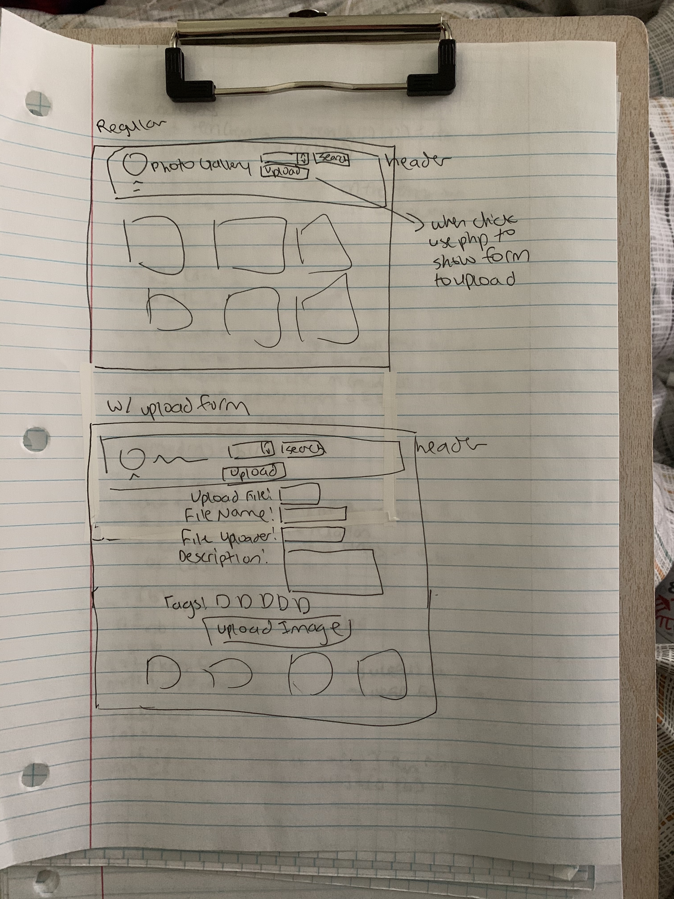
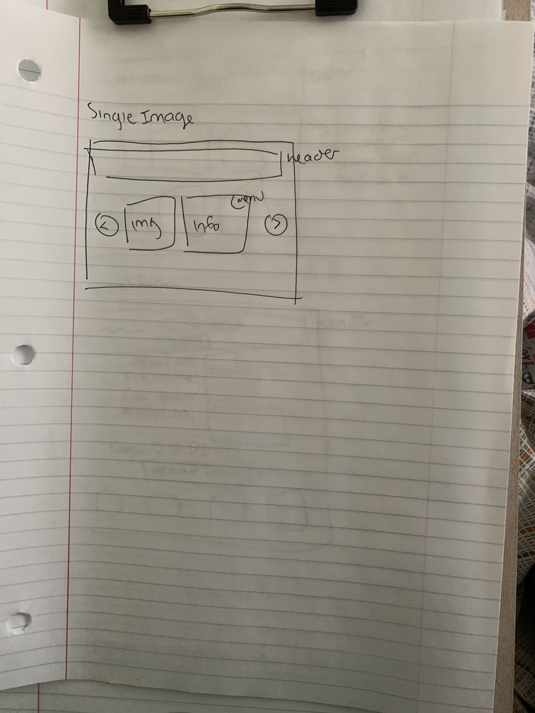

# Project 3: Design Journey

Be clear and concise in your writing. Bullets points are encouraged.

**Everything, including images, must be visible in VS Code's Markdown Preview.** If it's not visible in Markdown Preview, then we won't grade it.

# Design & Plan (Milestone 1)

## Describe your Gallery (Milestone 1)
> What will your gallery be about? 1 sentence.
My gallery will be of pictures of the seniors in a club I am in -- I am thinking of it as a would be a nice farewell gift for them to look back on (If this does not seem like a good idea please tell me :) )

> Will you be using your existing Project 1 or Project 2 site for this project? If yes, which project?
No

> If using your existing Project 1 or Project 2, please upload sketches of your final design here.
N/A

## Target Audience(s) (Milestone 1)
> Tell us about your target audience(s).
Seniors in a club that I am a part of (E.Motion) -- The club is more of a club sport/social club rather than a business-esque club, and since our club is quite informal I feel that an image gallery would work well. In addition, our seniors are always a huge part of the club, so being able to look back on the year/years seems like a nicething to have.

## Design Process (Milestone 1)
> Document your design process. Show us the evolution of your design from your first idea (sketch) to design you wish to implement (sketch). Show us the process you used to organize content and plan the navigation (card sorting), if applicable.
> Label all images. All labels must be visible in VS Code's Markdown Preview.
> Clearly label the final design.

First Draft


Final Design




## Design Patterns (Milestone 1)
> Explain how your site leverages existing design patterns for image galleries.
> Identify the parts of your design that leverage existing design patterns and justify their usage.
> Most of your site should leverage existing patterns. If not, fully explain why your design is a special case (you need to have a very good reason here to receive full credit).

The galleries I looked at was Google Photos and Dropbox.

I originally was thinking of having the search option with a menu, but while looking at these two sites, I realized that there is usually a search bar of some sort near the top of the page. I think I might follow the same pattern because it allows easy access to searching/filtering, and there's a high chance that the user would want to filter through the images, especially if there is a lot.

All the photo galleries have a delete function. I think for this project, it would make more sense to also include a report function, since this is a collective photo gallery, so it wouldn't make sense to allow everyone to be able to delete a picture. In the future, if a sign in process can be coded, what could be doneis that only certian people could delete. But for the sake of this project, I think it would be best to only have a delete function.

I noticed that information about the image is usually hidden, which makes sense becuase the user probably doesn't want to know when it was uploaded, who uploaded etc. However, I like how in Pinterest,there's the image, and then next to it there is information about the image. I think this would be good thing to include, since it would showcase the different tags, and it's also a good place to include citations.

A lot of current design patterns toggle between menus and individual buttons. It looks like features that aren't used as much are usually within a menu dropdown, while functions that are more likely to be used are in a button form. I think that uploading a new image should definitely be its own button, since it is a feature that helps create the image gallery. I would put deleting an image, reporting an image,removing a tag, and adding a new tag to an image in a dropdown menu.


## Requests (Milestone 1)
> Identify and plan each request you will support in your design.
> List each request that you will need (e.g. view image details, view gallery, etc.)
> For each request, specify the request type (GET or POST), how you will initiate the request: (form or query string param URL), and the HTTP parameters necessary for the request.

Example:
- Request: View images by tag
  - Type: GET
  - Params: tag

- Request: View a singular image
  - Type: GET
  - Params: image_id

- Request: View details of an image
  - Type: GET
  - Params: image_id

- Request: Add an image
  - Type: POST
  - Params: image_id

- Request: Add existing tag to an existing image
  - Type: POST
  - Params: image_id and tag

- Request: Add a new tag to an existing image
  - Type: POST
  - Params: image_id and tag

- Request: Deleting an image
  - Type: POST
  - Params: image_id


## Database Schema Design (Milestone 1)
> Plan the structure of your database. You may use words or a picture.
> Make sure you include constraints for each field.

> Hint: You probably need `images`, `tags`, and `image_tags` tables.

> Hint: For foreign keys, use the singular name of the table + _id. For example: `image_id` and `tag_id` for the `image_tags` table.


```
images (
id: INTEGER {PK, U, Not, AI}
name: TEXT {U, Not}
file_ext: TEXT {U, Not}
uploader: TEXT {U, Not}
description: TEXT  {U, Not}
citation: TEXT
)

tags{
id : INTEGER {PK, U, Not, AI}
name :TEXT {U, Not}
}

image_tags{
id : INTEGER {PK, U, Not, AI}
image_id : INTEGER {Not}
tag_id : INTEGER {Not}
}

```

## Database Query Plan (Milestone 1)
> Plan your database queries. You may use natural language, pseudocode, or SQL.
> Using your request plan above, plan all of the queries you need.

- Creating the tables

CREATE TABLE images (
	id INTEGER NOT NULL PRIMARY KEY AUTOINCREMENT UNIQUE,
    name TEXT NOT NULL UNIQUE,
	file_ext TEXT NOT NULL,
	uploader TEXT NOT NULL,
	description TEXT NOT NULL,
	citation TEXT
);

CREATE TABLE tags (
	id INTEGER NOT NULL PRIMARY KEY AUTOINCREMENT UNIQUE,
	name TEXT NOT NULL UNIQUE,
);

CREATE TABLE image_tags (
	id INTEGER NOT NULL PRIMARY KEY AUTOINCREMENT UNIQUE,
	image_id INTEGER NOT NULL,
	tag_id INTEGER NOT NULL,
);

- Adding an image

INSERT INTO images (name, file_ext, uploader, description) VALUES ( :upload_title, :upload_ext, :upload_uploader, :file_description)

- Adding a tag to an existing image

if a tag does not exist:
  INSERT INTO tags (name) VALUES (':tag_name')
  INSERT INTO image_tags (image_id, tag_id) VALUES ( :image_id, :tag_id)

if a tag exists:
  INSERT INTO image_tags (image_id, tag_id) VALUES ( :image_id, :tag_id)

- Remove tag:

DELETE FROM image_tags WHERE image_tags.image_id= :image_id AND image_tags.tag_id= :tag_id

- Showing certain images based on tags

SELECT DISTINCT images.id, images.name, images.file_ext FROM images LEFT OUTER JOIN image_tags ON images.id = image_tags.image_id LEFT OUTER JOIN tags ON image_tags.tag_id = tags.id WHERE tags.name = :search;

- Showing a single image

SELECT DISTINCT images.id, images.name, images.file_ext FROM images LEFT OUTER JOIN image_tags ON images.id = image_tags.image_id LEFT OUTER JOIN tags ON image_tags.tag_id = tags.id WHERE tags.name = :search;

-Delete Image

DELETE FROM images WHERE images.id = :single_image_id
DELETE FROM image_tags WHERE image_tags.image_id= :image_id


## Code Planning (Milestone 1)
> Plan what top level PHP pages you'll need.
The plan is depending on what button is clicked, a different PHP section will open. For example, if the user click on a button to upload an image, then a section will open up due to PHP to allow the user to upload an image

> Plan what partials you'll need.
- Since this is only one page, there are no need for any spcific partals.

> Plan any PHP code you'll need.
- If the upload image button is clicked:
  Then PHP will open up a form to allow for an image to be uploaded
- If previous image button is clicked:
  Then PHP will lead tp he previous image in the database
- If next image button is clicked:
  Then PHP will lead to the previous image in the database
- If an image is clicked on:
  Then PHP will change the page to that where a singular image is shown.


# Complete & Polished Website (Final Submission)

## Gallery Step-by-Step Instructions (Final Submission)
> Write step-by-step instructions for the graders.
> For each set of instructions, assume the grader is starting from index.php.

Viewing all images in your gallery:
1. In the header there is a drop down menu. Click all photos to view.
2. Click the search button

View all images for a tag:
1. In the header there is a drop down menu. Click the corresponding tag you want to view.
2. Click the search button

View a single image and all the tags for that image:
1. Click on an image in the gallery

How to upload a new image:
1. In the header click the upload image button. A form will appear.
2. Fill out the form and click the upload Image button at the bottom of the form.

How to delete an image:
1. From the gallery with all photos, click on the image you want to delete
2. Click on menu and a drop down menu will appear
3. Click on delete image

How to view all tags at once:
1. In the header there is a drop down menu. Click on the down menu.
2. All tags will be listed in the drop down menu.

How to add a tag to an existing image:
1. From the gallery with all photos, click on the image you want to add a tag for
2. Click on menu and a drop down menu will appear
3. Click on "Add Tag"
4. Select the tag you want to add in the drop down menu that appears
5. Click "Add Tag!"

How to remove a tag from an existing image:
1. From the gallery with all photos, click on the image you want to remove a tag for
2. Click on menu and a drop down menu will appear
3. Click on "Remove Tag"
4. Select the tag you want to add in the drop down menu that appears
5. Click "Remove Tag!"


## Reflection (Final Submission)
> Take this time to reflect on what you learned during this assignment. How have you improved since starting this class?

This assignment really worked my knowledge of PHP and SQL.There was a lot that I didn't know I'd be able to do for this project, which really show show we learned a lot in this class. In this assignment, there was a lot happening, especially with the huge amount of requests, so it really showed how important it was to keep things organized, and to know what you need to do. It was wuite funny since a lot would work at one point, but after trying to improve the code it mught not work etc, so it was a pretty long process overall. I tried a different way of organizing the code and it was pretty helpful. As for improvements, I feel that although I'm still not the best with CSS, I definitely feel like I was beter now then in the beginnng of the semester. I definitely also think I have a much better idea of PHP now
